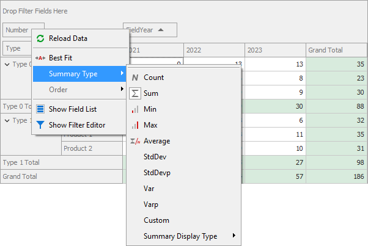

<!-- default badges list -->

<!-- default badges end -->

# Pivot Grid for WinForms - How to change SummaryDisplayType in the Context Menu

This example shows how to customize the Summary Type menu via the <a href="https://documentation.devexpress.com/WPF/DevExpress.Xpf.PivotGrid.PivotGridControl.PopupMenuShowing.event">PivotGridControl.PopupMenuShowing</a> event to allow Summary Display Type changing. Please note that it is necessary to set the <a href="https://documentation.devexpress.com/#CoreLibraries/DevExpressXtraPivotGridPivotGridFieldOptions_AllowRunTimeSummaryChangetopic">PivotGridFieldOptions.AllowRunTimeSummaryChange</a> property to <em>True</em> to allow this menu showing.

 

<!-- default file list -->
## Files to Look at

* [Form1.cs](./CS/WindowsApplication34/Form1.cs) (VB: [Form1.vb](./VB/WindowsApplication34/Form1.vb))
* [Program.cs](./CS/WindowsApplication34/Program.cs) (VB: [Program.vb](./VB/WindowsApplication34/Program.vb))
<!-- default file list end -->

## Documentation 
- [PivotGridControl.PopupMenuShowing](https://docs.devexpress.com/WindowsForms/DevExpress.XtraPivotGrid.PivotGridControl.PopupMenuShowing)
- [Header Area Context Menu](https://docs.devexpress.com/WindowsForms/1725/controls-and-libraries/pivot-grid/ui-elements/header-area-context-menu)
## More Examples
- [Pivot Grid for WinForms - How to Customize the Popup Menu to Hide or Show the Totals](https://github.com/DevExpress-Examples/how-to-toggle-totals-visibility-at-runtime-e923)
